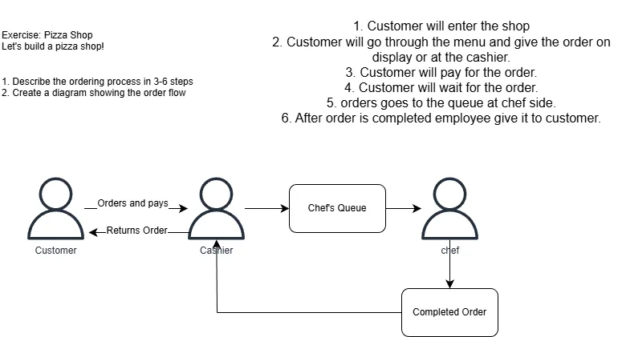
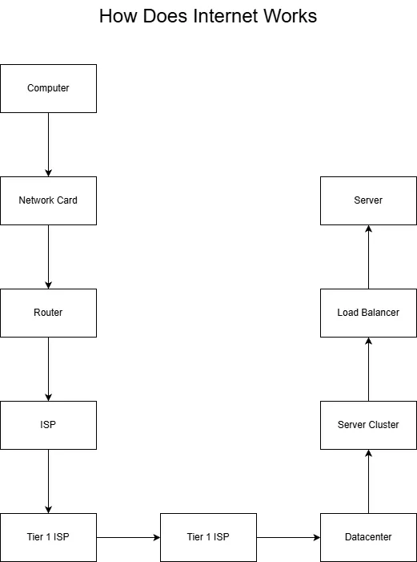
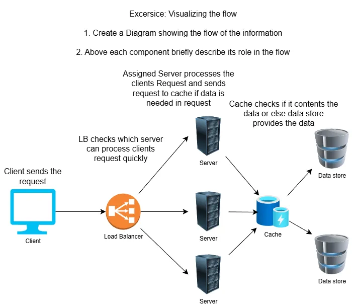
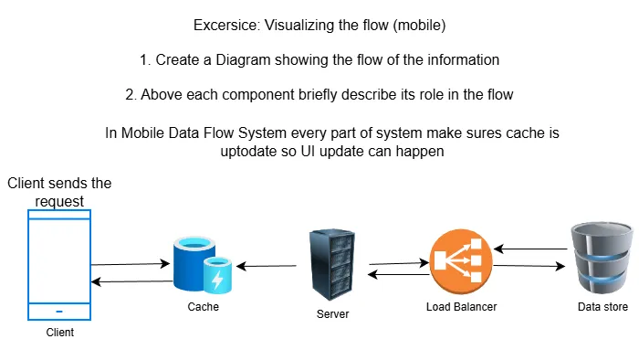

# Chapter-1-Recognizing **Systems**
- **Everything is a system.**
	- System has a trade-off
- **What is a system**
	- A collection of components that work together
	- Has input and outputs
	- Has Boundaries (what's inside, what's outside)
		- System are endless so focusing on important details is important and defining boundaries.
***
- **Exercise:** Design a system for pizza shop]
- The solution for this exercise was different for different people as I in this diagram showed the processes as A CUSTOMER some showed the process as A OWNER or as A CHEF like taking out a dough, rounding it, adding toppings, placing it in oven, cutting it and boxing it, etc,  but in the end customer got their pizza and that's important.
***
- **What is distributed system**
	- Multiple computers work together as a single system
	- Components may be physically separated
	- Designed to handle <u>failures</u> and <u>scale</u> across multiple locations.
- **What are the two main reasons for creating distributed system?**
	- Distributed systems are created to handle failure and to be able to scale. It's difficult to scale just one machine (vertical scaling), and a single machine creates a single point of failure. By distributing across multiple machines, systems can better handle load and avoid catastrophic failures.
***
- How Does Internet Works 
***
- **Common System Components**

| Component     | Role                                                          |
| ------------- | ------------------------------------------------------------- |
| Client        | Sends requests, displays data to users.                       |
| Database      | Stores, updates and retrieves data.                           |
| Server        | Processes requests, business                                  |
| Load Balancer | Distributes incoming traffic to keep things running smoothly. |
| Cache         | Make things faster by temporarily storing data.               |
- **Example of a client:**
	- **Types:** Browser, Mobile apps, TV
	- **Inputs:** User Actions
	- **Outputs:** Server requests, UI Updates
- **Example of a Server**
	- Types: Web Server, API, Video Processor
	- Inputs: requests
	- Outputs: responses (HTML, JSON, etc), server updates, database queries, modified data.
- **Example of a Load Balancer (LB):**
	- Types: Software LB, Hardware LB
	- Inputs: requests
	- Outputs: routed requests
- **Database (Data Store):**
	- Types: Relational(SQL), non-relational(NoSQL), specialized (Graph, object-oriented, vector, etc)
	- Inputs: Queries
	- Outputs: Data, Status response, Objects (Images ,etc)
- **Cache:**
	- Type: Client, Server, CDN's, In-memory
	- Inputs: Keys
	- Outputs: cached Data
- **What is the primary difference between a cache and a database?**
	- While both store data, a cache stores temporary data and is designed to be close to where the data is needed (either close to the user or close to the data source) to make things faster. A database stores persistent data. Caches typically use strategies like least recently used (LRU) for managing temporary data, whereas databases are designed for long-term storage and retrieval.
***
- Visualizing Flow of Data: 
- **Why Mobile arch is different?**
	- In a mobile application, the UI is already baked into the client (installed from the app store), so a web server isn't needed to serve the UI. The mobile app typically makes API requests directly to get data rather than requesting UI components. This means the system's role shifts to primarily keeping caches up to date with data rather than serving both UI and data.
- **What is a pass-through cache and how does it handle cache misses?**
	- A pass-through cache is a caching strategy where the server checks the cache first. If there's a cache miss (data not found), the cache can forward the request directly to the database. Alternatively, the request can bounce back to the server, which then queries the database. The data is then stored in the cache for future requests.
- **Why might you place a cache in front of a database, and what type of data would it typically store?**
	- A cache placed in front of a database (**called a query cache**) helps expand the capacity and power of the database. Instead of making full database lookups every time, it stores common queries like fetching homepages or news feeds. This reduces the load on the database by serving frequently requested data directly from the cache.
***
