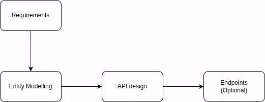
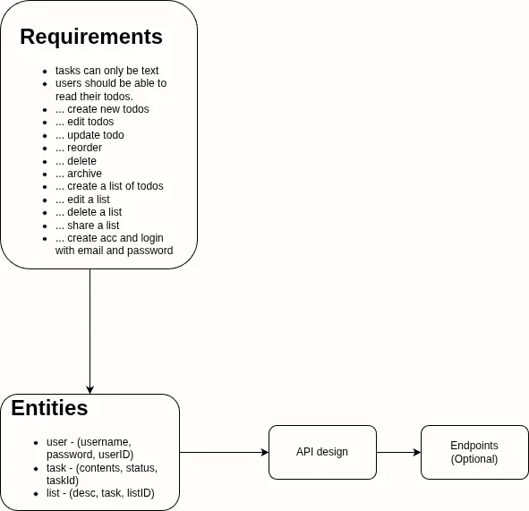

# Modelling

- **Entity modelling**: Define the main functional elements.
- **API Design**: Define the actions and operations of the system.

***
## Questions
1. **What are the two main aspects of modeling requirements in system design?**
	1. Entity modeling (identifying the core components and most important things in the system).
	2. API design (defining the actions and operations of the system). 
	3. These are derived from the functional and non-functional requirements.