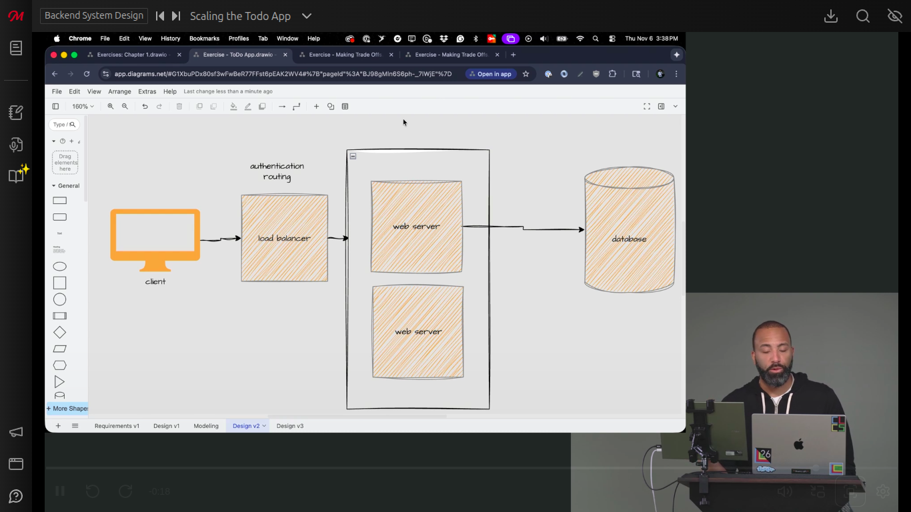

# Scaling the Todo App

## Questions
1. In a system architecture diagram, what component should be placed at the edge to distribute incoming traffic across multiple servers?
	1. A load balancer should be placed at the edge to distribute incoming traffic across multiple servers.
2. When sketching a system architecture diagram, how can you represent multiple servers in a cluster without drawing each individual server?
	1. You can draw a container around a few server instances to imply that it's a cluster. This convention indicates there are multiple servers (potentially 20, 30, or 50) without having to sketch out each one individually.
3. For a read-heavy database application, what component is typically placed in front of the database to improve performance and handle 100,000+ users?
	1. A cache is typically placed in front of the database for read-heavy applications to improve performance and handle high user loads.
4. In a system architecture diagram with multiple boxes and arrows, what practice helps clarify the purpose of each component?
	1. Labeling what each component is doing helps clarify the system. For example, noting that the load balancer is handling authentication and routing, or that the web server is handling business logic and API requests.
5. Where can load balancers be positioned in a system architecture besides at the edge in front of web servers?
		1. Load balancers can also be positioned in front of multiple databases, though this addresses a different type of problem related to database distribution.
6. 